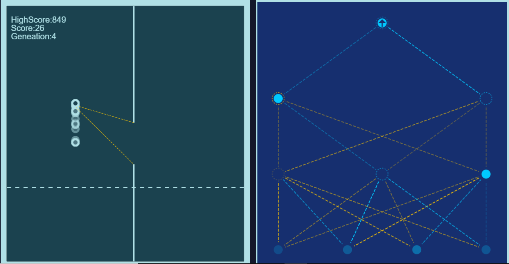

# WallDodger_AI

* It is an automated game in which ball continuously falls down if ball touch surface or obstacle game will over.
* AI game, Uses Neural network and the Input of Neural network depending upon current ball position, and position of next Obstacle.

TO-DO:

- [ ] Add Pre trained Model
- [ ] Add The timer for training

## About The Project

### Built With


* Javascript
* HTML
* CSS

## Getting Started

This is an example of how you may give instructions on setting up your project locally.
To get a local copy up and running follow these simple example steps.

### Installation

Fork, then download or clone the repo.
```bash
https://github.com/Kalaria-Bhargav/Auto-Wall-Dodger.git
```
Run the Html file

## Contributing

Any contributions you make are **Highly appreciated**.

1. Fork the Project
2. Create your Feature Branch (`git checkout -b feature/AmazingFeature`)
3. Commit your Changes (`git commit -m 'Add some AmazingFeature'`)
4. Push to the Branch (`git push origin feature/AmazingFeature`)
5. Open a Pull Request

 <!-- PROJECT LOGO -->
<p align="center">

 <a href="https://github.com/othneildrew/Best-README-Template">
    <kbd></kbd>

  </a>
 </p>
